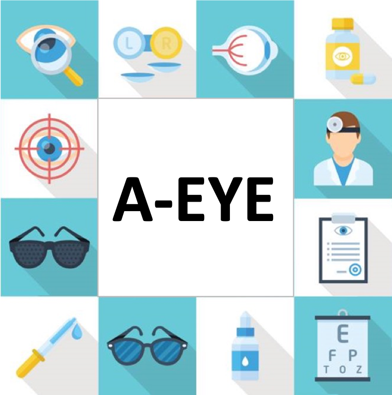

## SECTION 1 : PRS-PM-ISY5002-GROUP5
## Pattern Recognition Systems

---  

## SECTION 2 : EXECUTIVE SUMMARY / PAPER ABSTRACT

Healthcare is undergoing a major transformation from reactive care to a more proactive approach. For this purpose, Singapore has recently announced a major healthcare initiative focusing on preventive care: Healthier SG. Amongst the five key features, Healthier SG aims to mobilise family doctors to deliver preventive care and develop health plans for regular health screening.

However, medical care is segmented into specialised areas of expertise. Ophthalmology is one such area where primary care physicians will often seek the help of the Ophthalmologists for diagnosis and management. This increases the time and cost for patient before he or she receives treatment.

Our group project addresses the need for accessible rapid eye diagnosis. Our system identifies salient clinical features via a colour fundus photo to infer a clinical diagnosis and presents it to the physician. This will allow the primary care physician to better determine whether the patient requires a specialist consultation.

---

## SECTION 3 : PROJECT TEAM MEMBERS

| Official Full Name  | Student ID (MTech Applicable)  | Email |
| :------------ |:--------------- |:-----|
| Zhong Xiaohui | A0249305E | e0938910@u.nus.edu |
| Lim Chang Siang | A0176266W | e0231993@u.nus.edu |
| Li Zhenghao, Kelvin | A0031400J | e0396343@u.nus.edu |
| Zheng Xiaolan | A0249271B | e0938876@u.nus.edu |

---

## SECTION 4 : VIDEO OF SYSTEM MODELLING & USE CASE DEMO
`Please refer to the video at hosted on YouTube`

`<Video Link>` : <https://www.youtube.com/watch?v=MiHgiPaYc_g>

---
## SECTION 5 : MID-PROJECT PRESENTATION
`Please refer to Mid-Project Presentation at Github Folder: ProjectSlides`

`<File Link>` : <https://github.com/changsiang/PRS-PM-IS04PT-ISY5002-GROUP6/tree/main/ProjectSlides>

---
## SECTION 6 : PROJECT REPORT / PAPER
`Please refer to Project report at Github Folder: ProjectReport`

`<File Link>` : <https://github.com/changsiang/PRS-PM-IS04PT-ISY5002-GROUP6/tree/master/ProjectReport>

---

**The [Machine Reasoning (MR)](https://www.iss.nus.edu.sg/executive-education/course/detail/machine-reasoning "Machine Reasoning"), [Reasoning Systems (RS)](https://www.iss.nus.edu.sg/executive-education/course/detail/reasoning-systems "Reasoning Systems") and [Cognitive Systems (CGS)](https://www.iss.nus.edu.sg/executive-education/course/detail/cognitive-systems-sf "Cognitive Systems") courses are part of the [Master of Technology in Intelligent Systems](https://www.iss.nus.edu.sg/stackable-certificate-programmes/intelligent-systems "Intelligent Reasoning Systems") offered by [NUS-ISS](https://www.iss.nus.edu.sg "Institute of Systems Science, National University of Singapore").**